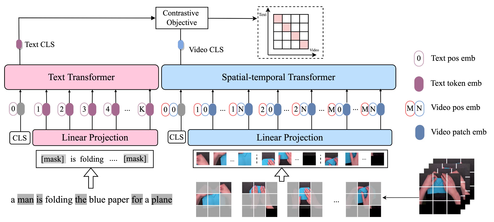
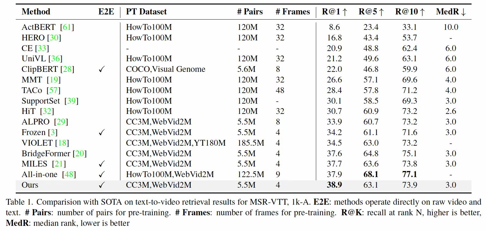

# MAC

[Masked Contrastive Pre-Training for Efficient Video-Text Retrieval, arxiv 2022](https://arxiv.org/pdf/2212.00986.pdf), 

We present a simple yet effective Masked
Contrastive Video-and-Language Pre-training framework for efficient video-text retrieval. Instead of blindly applying the mask-then-prediction
paradigm from MAE, we propose a masked-then-alignment
paradigm for efficient video-text alignment with random masking on both video and text. Our MAC
enables efficient end-to-end pre-training: reduce FLOPs
(60% off), accelerate pre-training (by 3x), and improve performance. 



## Pre-Training
1. Download WebVid2M (see https://github.com/m-bain/webvid)

2. Download CC3M (see https://ai.google.com/research/ConceptualCaptions/download)

## Finetune
1. Download MSRVTT (see https://www.robots.ox.ac.uk/~maxbain/frozen-in-time/data/MSRVTT.zip)
2. Download DiDeMo (see https://github.com/LisaAnne/TemporalLanguageRelease)
3. Download ActivityNet (see https://github.com/activitynet/ActivityNet)
## Results
We achieve SOTA results on various video-text retrieval datasets including MSR-VTT, DiDeMo, and ActivityNet. Below is the result on MSRVTT, more details can be found in our paper.




## Citation

If you find our paper helpful in your research, please cite:

```bibtex
@article{shu2022masked,
  title={Masked Contrastive Pre-Training for Efficient Video-Text Retrieval},
  author={Shu, Fangxun and Chen, Biaolong and Liao, Yue and Xiao, Shuwen and Sun, Wenyu and Li, Xiaobo and Zhu, Yousong and Wang, Jinqiao and Liu, Si},
  journal={arXiv preprint arXiv:2212.00986},
  year={2022}
}
```


## LICENSE
This project is licensed under the MIT License. See [LICENSE](LICENSE) for more details

## Acknowledgements
This code is build on [Frozen in time](https://github.com/m-bain/frozen-in-time) and [MAE](https://github.com/facebookresearch/mae), We thank the authors for their awesome projects